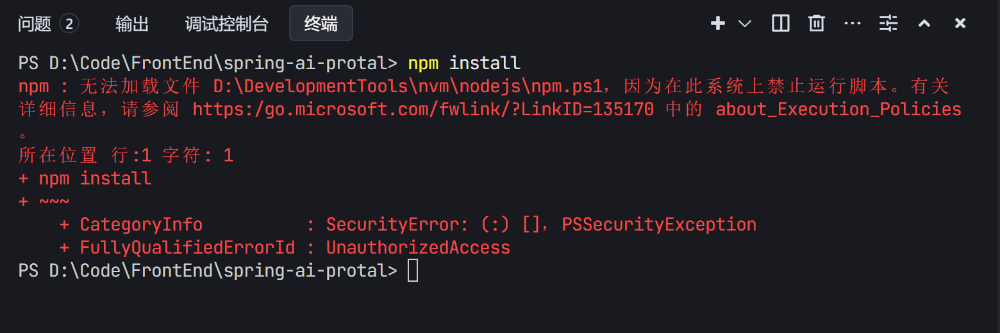
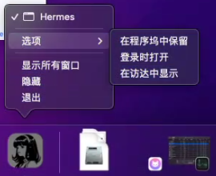
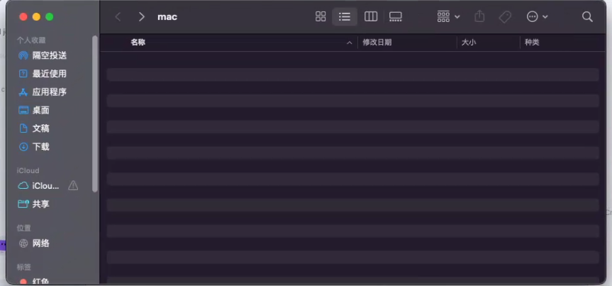

## 最基本的前置工作

1. 如果对方没有梯子，我们就要给他准备梯子的安装包下载连接`https://file.cat-cdn.com/v1/Clash.Verge_1.7.5_x64-setup.exe`

2. 开启梯子

3. 梯子的配置

   如果是SakuraCat，那么开启TUN模式就行

   如果用的是Clash 这种，那么需要开启`局域网连接、虚拟网卡`的设置

## 安装方式选择

优先考虑windows mac原生安装，实在不行才是wsl2安装

## Hermes 安装流程

1. 前置工作做好

2. 根据平台，安装hermes

3. 安装hermes-web-ui，执行`npm i -g hermes-web-ui`

   可能会遇见两个错误：

   1. `缺失node环境`，如果使用的是国内镜像安装就会出现这个问题。手动去nodejs官网 [Node.js — 在任何地方运行 JavaScript ](https://nodejs.org/zh-cn) 下载安装即可
   2. `此系统上禁止运行脚本`，管理员身份在环境中，执行` Set-ExecutionPolicy RemoteSigned` 即可

4. 将网关自启动，执行`hermes gateway install`

5. (可选) 给用户安装命令版桌面版，执行`hermes desktop`

## WSL2 安装命令

>win10可以提前装一个`window terminal `

1. wsl --update
2. wsl --install --web-download --location D:\wsl


- wsl.exe --set-default-version <1|2>

- wsl --list --online


- 退出wsl：exit

- wsl --shutdown

## WSL2排查错误


### 1-虚拟化前提

必须确定开启了虚拟化

AMD ： 

SVM Mode
NX/DX mode


英特尔：待补充

### 2-window功能开启

hyper + 虚拟化平台 + WSL


## Windows原生安装到D盘

如下代码所示，有需要需要替换下载脚本链接

```powershell
& ([scriptblock]::Create((irm https://raw.githubusercontent.com/NousResearch/hermes-agent/main/scripts/install.ps1))) `
-HermesHome "D:\MyApps\Hermes" `
-InstallDir "D:\MyApps\Hermes\hermes-agent" `
-ShowResolvedPaths
```


## 实际案例-中文文档下载脚本缺失node环境

如果用的是`Hermes 中文文档网站`的下载安装的脚本, 会缺失nodejs环境, 具体表现为:

- npm/node 未找到此脚本

如果安装了node, 最好执行一次`npm -v`命令, 有可能会报错, 具体表现为

- 在此系统上禁止运行脚本 (执行`Set-ExecutionPolicy RemoteSigned` 解决)

## 实际案例-装完后完善ui启动的教程

1. 桌面上编写一个cmd脚本

   ```cmd
   hermes-web-ui
   ```

2. 用edge的功能，设置=> 更多工具 => 应用 => 将此站点作为应用安装

## 实际案例-让下载速度更加的快

用自己的梯子

开启全局 + tun + 系统代理


## 实际案例-优先安装桌面版

windows：

执行`hermes desktop` 命令

然后右键`桌面版`窗口 => 再右键 => 找到属性 => 打开文件所在位置 => 为它创建一个快捷方式 


mac：

依旧执行`hermes desktop`命令

1. 找到启动后的hermes desktop，右键，选择`在访达中显示`
2. 然后将这里出现的`hermes`，按住拖动到`应用程序`中即可
3. 然后`应用程序`中就能看到`hermes`了，到此就已经帮助用户创建了快捷方式


## 实际案例-备份和导入

全量备份 hermes backup -o hermes-backup.zip

安装空白本体后导入 hermes import .\hermes-backup.zip

## 实际案例-满血版

满血版就是

- 设置soul文件
- 接入记忆系统
- 接入图像生成`fal.ai`
- 语音文字edge tts(内置)
- 全网抓取工具（Firecrawl）
- 全网搜索工具（tavliy）
- 语音识别 hermes tools install whisper


### skills 推荐

>排除内置的skill

-  clawhub/pdf-markdown-converter
- ppt设计类
  - 让ppt设计更加好看：hermes skills install clawhub/ppt-design-master
  - 中文公关写作：hermes skills install clawhub/chinese-official-writing
  - [alchaincyf/huashu-design: Huashu Design · HTML-native design skill for Claude Code · Claude Code 里 HTML 原生的设计 skill · 高保真原型 / 幻灯片 / 动画 + 20 设计哲学 + 5 维评审 + MP4 导出 · Agent-agnostic](https://github.com/alchaincyf/huashu-design)

[hugohe3/ppt-master: AI turns documents or topics into real, native PowerPoint decks—with native shapes, transitions and animations, data-backed charts and tables on demand, audio narration from speaker notes, and support for your own .pptx templates. · by Hugo He](https://github.com/hugohe3/ppt-master)


[[中文\] Windows + 中国网络：Hindsight 本地部署完整指南（踩坑记录） · Issue #1517 · vectorize-io/hindsight](https://github.com/vectorize-io/hindsight/issues/1517)
